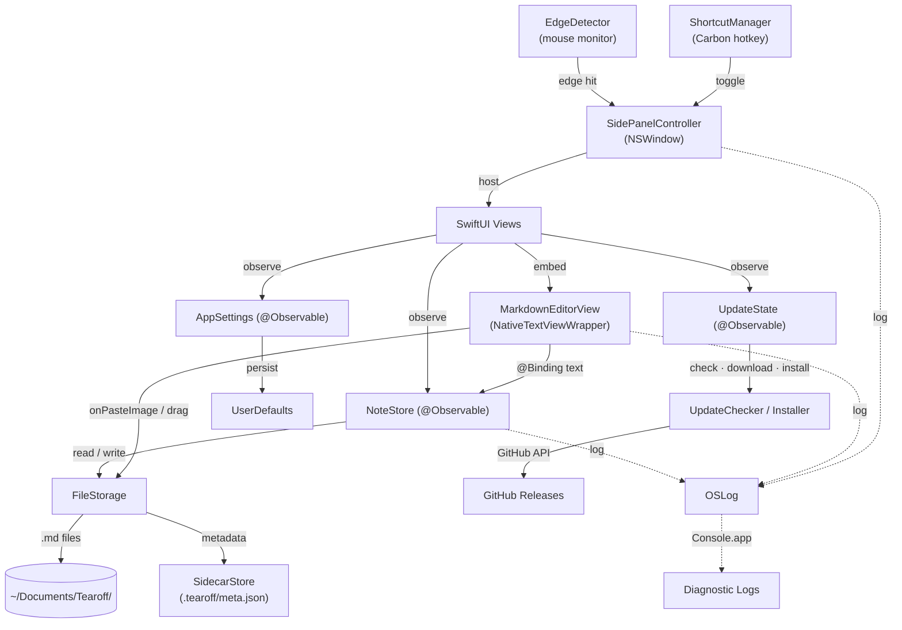

# Contributing to Tearoff

**Requirements:** macOS 15.7+, Xcode 16.2+, [Homebrew](https://brew.sh)

```bash
brew install swiftformat
```

Code style is enforced by [SwiftFormat](https://github.com/nicklockwood/SwiftFormat) via CI — rules are in `.swiftformat` at the project root.

---

# Architecture

## Data Flow



## Source Tree

```
Tearoff/
├── App/                            # Entry point + global state
│   ├── TearoffApp.swift           #   @main, menu bar utility (LSUIElement)
│   ├── AppDelegate.swift           #   Lifecycle, sidecar migration, shortcut setup, switchRoot + menu-bar storage submenu
│   └── ContentView.swift           #   Navigation shell (folders → notes → editor)
│
├── Core/                           # Business logic — no SwiftUI imports
│   ├── Editor/
│   │   ├── MarkdownEditorView.swift      # SwiftUI wrapper around NativeTextViewWrapper
│   │   │                                #   (swift-markdown-engine). Heading strip,
│   │   │                                #   debounced save, image conversion layer,
│   │   │                                #   slash command integration.
│   │   ├── EditorConfigFactory.swift      # Shared MarkdownEditorConfiguration (insets,
│   │   │                                #   highlight/strikethrough extensions, task-checkbox
│   │   │                                #   symbols, image/syntax/latex services) for both editors
│   │   ├── ReadOnlyMarkdownView.swift    # Non-editable preview (trash)
│   │   ├── SlashCommandHandler.swift     # /h1, /todo, /code, /quote — NSTextView insertion
│   │   ├── SlashCommandPopup.swift       # Floating autocomplete panel
│   │   └── ImageDropHandler.swift        # Transparent NSView overlay for image drag-and-drop
│   ├── Settings/
│   │   ├── AppSettings.swift       #   @Observable — sort, panel style/tint, editor font/checkbox, spell-check, peek, tags, + appearance/updates/launch
│   │   ├── ShortcutSettings.swift  #   Global + 6 local keyboard shortcuts + conflict detection (posts .shortcutSettingsChanged)
│   │   ├── PanelSettings.swift     #   Edge activation, dismissal, panel width/animation, swipe gestures (.panelPinStateChanged)
│   │   └── StorageSettings.swift   #   Storage roots (#55) + active/ask-on-launch/session-override (.storageRootChanged)
│   ├── Shortcuts/
│   │   ├── ShortcutManager.swift   #   Carbon RegisterEventHotKey global shortcut
│   │   └── KeyCodeTranslator.swift #   Virtual key code → display string mapping
│   ├── Finder/                     # Finder-card engine (no UI)
│   │   ├── FinderCardBrowser.swift #   @Observable per-card browser — background enumeration, file ops, watcher lifecycle
│   │   ├── DirectoryWatcher.swift  #   One DispatchSource vnode watcher per visible card (debounced, fd closed on stop)
│   │   ├── FileIconCache.swift     #   NSCache of 16pt file icons keyed by UTType / folder / package path
│   │   └── FinderEntry.swift       #   Row model (url, name, isDirectory, isPackage, date, size, UTType id)
│   ├── Storage/
│   │   ├── NoteStore.swift         #   @Observable — note + Finder-card CRUD, trash, folders, tag filter, multi-selection + batch ops, move-conflict queue
│   │   ├── FileStorage.swift       #   Plain .md file I/O (no YAML); asset dir management
│   │   ├── SidecarStore.swift      #   In-memory .tearoff/meta.json store + persistence (v4: notes, trash, folders, finderCards)
│   │   ├── SidecarMigration.swift  #   One-time migration: strips YAML, restores timestamps
│   │   ├── Note.swift              #   Note model (id, title, body, timestamps, tags, savedAt)
│   │   ├── FinderCard.swift        #   Finder card model (favourites, selected favourite, current path, pin/order/color) — sidecar-only, no .md
│   │   ├── BoardItem.swift         #   enum { note | finder } — the board's single ordered card stream
│   │   ├── Folder.swift            #   Folder model
│   │   ├── TagColor.swift          #   Finder-style 7-color tag palette
│   │   └── TrashedFolder.swift     #   Trashed folder with expiry metadata
│   ├── Updates/
│   │   ├── UpdateChecker.swift     #   GitHub Releases API, version comparison
│   │   ├── UpdateDownloader.swift  #   URLSession delegate with progress tracking
│   │   ├── UpdateInstaller.swift   #   DMG mount → verify → copy → replace → restart
│   │   ├── UpdateModels.swift      #   GitHubRelease, UpdateProgress, UpdateError
│   │   ├── UpdateState.swift       #   @Observable — update UI state machine
│   │   └── ChecksumVerifier.swift  #   SHA256 verification via CryptoKit
│   └── Window/
│       ├── SidePanelController.swift     # NSWindowController — show/hide/animate
│       ├── EdgeDetector.swift            # Global mouse monitor → edge activation
│       ├── SettingsWindowController.swift # Settings window lifecycle
│       └── UpdateWindowController.swift  # Update window lifecycle
│
├── UI/                             # SwiftUI views
│   ├── EditorScreen.swift          #   Editor chrome (header, editor, footer)
│   ├── Navigation/
│   │   ├── HomeFolderView.swift    #   Folder list with create/rename/trash; hosts the ask-on-launch storage picker (in-card mode)
│   │   ├── NoteListView.swift      #   Note cards with search, sort, context menus
│   │   └── TrashView.swift         #   Trash browser with restore/delete/empty
│   ├── Components/
│   │   ├── ContentFooterBar.swift  #   Bottom toolbar (word count, copy format picker)
│   │   ├── DateFormatting.swift    #   Shared date → display string helpers
│   │   ├── EmptyStateView.swift    #   Icon + title + subtitle placeholder
│   │   ├── FontPickerButton.swift  #   NSFontPanel button with live changeFont(_:) preview
│   │   ├── HeaderIconButton.swift  #   Standard icon button with hover UX
│   │   ├── InlineRenameEditor.swift#   Inline text field with "Name taken" overlay
│   │   ├── MoveConflictAlerts.swift#   View extension: note + folder move conflict dialogs
│   │   ├── NSContextMenuModifier.swift  # NSMenu context menus with SF Symbol icons
│   │   ├── NoteCardView.swift      #   Note list row (title, preview, date)
│   │   ├── NoteListMenus.swift     #   Note/folder context menu builders (incl. Tags submenu)
│   │   ├── FinderCardMenus.swift   #   Finder card / file / favourite context menus (Open With, Reveal, Trash …)
│   │   ├── PageLayout.swift        #   Navigation page chrome (header + content + footer)
│   │   ├── PinButton.swift         #   Toggle for PanelSettings.isPanelPinned
│   │   ├── ShortcutRecorderView.swift   # Key capture field for shortcut settings
│   │   ├── SwipeDetectorView.swift #   NSView wrapper for two-finger swipe gestures
│   │   ├── TagDotsView.swift       #   Inline colored dots for note rows
│   │   ├── TagFilterBar.swift      #   Search-context tag filter strip
│   │   └── VisualEffectView.swift  #   NSVisualEffectView wrapper with optional tint sublayer
│   ├── Finder/
│   │   ├── FinderCardView.swift    #   Finder card chrome: favourites bar, breadcrumb, list host, footer (mirrors BoardNoteCard)
│   │   ├── FinderFileListView.swift#   NSTableView file list — selection, inline rename, keyboard, drag source + drop target
│   │   └── FinderBrowserRegistry.swift # Live browsers by card id for panel-level hooks (Escape, ⌘⇧N, watcher suspend/resume)
│   └── Settings/
│       ├── SettingsView.swift      #   Tab container (General, Behavior, Tags, Keyboard, About)
│       ├── GeneralSettingsTab.swift #   Appearance (incl. panel style/tint), editor font, language, multi-root storage list
│       ├── BehaviorSettingsTab.swift#   Panel position, edge activation, auto-hide
│       ├── TagsSettingsTab.swift   #   Rename color tag labels
│       ├── KeyboardSettingsTab.swift#   Global + 6 customizable local shortcut recorders
│       ├── AboutSettingsTab.swift   #   Version info, links, copyright
│       └── UpdateView.swift        #   Download progress, verify, install UI
│
├── Shared/Utils/
│   ├── L10n.swift                  #   JSON-based i18n runtime
│   ├── Log.swift                   #   OSLog — 6 categories
│   └── Debouncer.swift             #   Generic debounce utility
│
└── Resources/
    └── Locales/                    # i18n strings
        ├── en.json                 #   English
        ├── zh-Hans.json            #   Simplified Chinese
        ├── hi.json                 #   Hindi
        ├── es.json                 #   Spanish
        └── de.json                 #   German
```

## Key Patterns

| Pattern | Detail |
|---------|--------|
| **@Observable** | `NoteStore`, `AppSettings`, and `UpdateState` use the `@Observable` macro — views read properties directly, no `@Published` needed |
| **MainActor by default** | `SWIFT_DEFAULT_ACTOR_ISOLATION = MainActor`. All types are `@MainActor` unless explicitly opted out |
| **AppKit + SwiftUI hybrid** | `NSHostingView` embeds SwiftUI inside a borderless `NSWindow`. Panel lifecycle managed by `SidePanelController` (AppKit), UI rendered by SwiftUI |
| **Native editor (swift-markdown-engine)** | `MarkdownEditorView` wraps `NativeTextViewWrapper` (NSViewRepresentable from swift-markdown-engine). Text flows via `@Binding<String>`. Heading stripping, image display-layer conversion (`` ↔ `![[path]]`), and save debouncing are handled in `MarkdownEditorView`. Both editors build their `MarkdownEditorConfiguration` via `EditorConfigFactory.makeTearoffConfig` (shared insets, highlight/strikethrough extensions, task-checkbox symbols from `AppSettings.taskCheckboxPreset`, and image/syntax/latex services) — so previews match the editor. Changing the checkbox preset rebuilds the view via `.id()` because the engine's `updateNSView` doesn't sync `taskCheckbox` live. |
| **Sidecar metadata** | Notes are plain `.md` files with no headers. Metadata (UUID, timestamps, tags, trash state) lives in `.tearoff/meta.json` keyed by UUID. `SidecarMigration` strips YAML on first launch and restores original file timestamps. `savedAt` (last Tearoff write) is the external-change sentinel; `modifiedAt` only advances on real content edits. |
| **Image asset co-location** | Images are stored in a hidden dot-prefix directory next to the note (`.NoteTitle/IMG-uuid.png`). Paths in `.md` files are standard `` — relative, readable in any external editor. The editor display layer converts them to `![[path]]` for rendering via `EmbeddedImageProvider`. `FileStorage` handles create/rename/move/trash/delete of asset dirs alongside their note. |
| **Carbon hotkeys** | Global shortcut uses `RegisterEventHotKey` (Carbon API) since `NSEvent.addGlobalMonitorForEvents` can't intercept key events |
| **Multiple storage locations** | `StorageSettings` owns a list of `StorageRoot`s + an `activeRootID` (persistent default) + an in-memory `sessionRootOverride` (menu-bar temporary switch, reverts on restart). `resolvedStorageDirectory` resolves session-override → active root → legacy → default. All storage (`FileStorage.rootURL`, `SidecarStore`, `.trash/`) reads the active root live, so flipping it re-points the whole layer — but in-memory `NoteStore`/`SidecarStore` must be reloaded (`AppDelegate.switchRoot(to:temporary:dismissPicker:)` is the single path: save dirty → set override/activeID → `SidecarStore.load` → `noteStore.loadFromDisk`, wrapped in `withAnimation` for a row crossfade). Per-root isolation: each root has its own sidecar, trash, and external-edit scope. |
| **Local shortcut monitor** | `SidePanelController` installs an `NSEvent.addLocalMonitorForEvents` that checks all six configurable local shortcuts at event time. Settings changes take effect immediately without re-registration. |
| **JSON i18n** | `L10n` loads locale JSON at runtime. Access: `l10n["key"]` or `l10n.t("key", arg1, arg2)` for interpolation |
| **OSLog diagnostics** | 7 categorized loggers (app, storage, window, shortcuts, navigation, updates, finder). View in Console.app with `subsystem:io.github.zcyisiee.Tearoff` |
| **Move conflict queue** | Name-conflict pre-flight uses filesystem-aware helpers (`noteFilenameWouldCollide`, `folderWouldCollide`) that check both in-memory state and the destination on disk. Conflicts are queued, not singletons — `MoveConflictAlerts` reads the queue head and surfaces batch buttons (Keep Both All / Replace All / Skip / Cancel) when more than one is pending. Resolver branches handle orphan files / directories at the destination. |
| **DMG auto-update** | `UpdateChecker` queries GitHub Releases API. `UpdateInstaller`: mount DMG → verify bundle ID → copy → replace → restart |
| **Finder cards** | A second card kind with no `.md` behind it — `FinderCard` lives only in the sidecar (`finderCards`, schema v4; older payloads decode unchanged). Notes and Finder cards share one identity space (UUID) and one ordered stream (`BoardItem`, `NoteStore.sortedBoardItems` / `reorderBoardItem`), so pin-first, manual order, folder tabs, and multi-selection work across both. The card chrome is SwiftUI (`FinderCardView`), the file list is an `NSTableView` (`FinderFileListView`) because it natively gives multi-select, inline rename, type-select, and — crucially — `NSDraggingSource` drag-out with begin/end callbacks. Drag-out suspends panel auto-hide via `SidePanelController.suspendAutoHide()` / `resumeAutoHide(treatAsMouseExit:)`. Watching is one `DispatchSource` vnode source per *mounted* card on its *current* directory only, debounced 200 ms; `FinderBrowserRegistry` suspends all watchers on `hidePanel` (fds closed, zero idle CPU) and re-enumerates + re-arms on `showPanel`. Keyboard focus is tracked in `NoteStore.focusedFinderCardID`: while set, the panel's ↑/↓/Return monitor stands down and ⌘⇧N creates a folder inside the card instead of a Tearoff folder; Escape clears the file selection first. |

---

# Localization

Tearoff uses a custom JSON-based i18n system. Currently supported:

| Language | File | Status |
|----------|------|--------|
| English | `Tearoff/Resources/Locales/en.json` | ✅ |
| Simplified Chinese | `Tearoff/Resources/Locales/zh-Hans.json` | ✅ |
| Hindi | `Tearoff/Resources/Locales/hi.json` | ✅ |
| Spanish | `Tearoff/Resources/Locales/es.json` | ✅ |
| German | `Tearoff/Resources/Locales/de.json` | ✅ |

## Contributing a Translation

1. Copy `Tearoff/Resources/Locales/en.json`
2. Rename to your [BCP-47 language code](https://en.wikipedia.org/wiki/IETF_language_tag) (e.g. `ja.json`, `ko.json`, `fr.json`, `de.json`, `pt-BR.json`)
3. Translate the values — keep the JSON keys unchanged
4. (Optional but appreciated) Add a translated `README-<code>.md` (e.g. `README-ja.md`) modeled on `README.md`, and add your language to the switcher row at the top of every `README*.md` (`English · 简体中文 · हिन्दी · Español · Deutsch · …`), bolding the current language in each file.
5. Submit a PR

No code, project, or build-phase changes are needed. The Xcode project uses Xcode 16 file-system synchronized groups, so any `.json` you drop into the folder is auto-bundled. The language picker enumerates locale files at runtime, and `L10n` matches the system language by prefix — `pt-BR.json` will be selected for any `pt-*` user, and so on. Native-script display names (e.g. "English", "简体中文", "हिन्दी") come from `Locale.localizedString(forIdentifier:)`, so no language-label keys need to be maintained.

### What reviewers check on translation PRs

- All keys from `en.json` are present (no missing strings → no English fallback in the UI).
- No leftover English values where the language has a native term.
- Placeholders (`{0}`, `{1}`, …) preserved in the same order.
- No structural changes to keys, only values.

---

# Submitting a Pull Request

- Target the `main` branch.
- Run `swiftformat Tearoff/` before pushing — CI fails on lint errors.
- **Do not modify** `MARKETING_VERSION` or `CURRENT_PROJECT_VERSION` in `Tearoff.xcodeproj/project.pbxproj`. Releases are cut by the maintainer from `main`/`develop`; PRs that bump these values will fail the `check-version` CI step.
