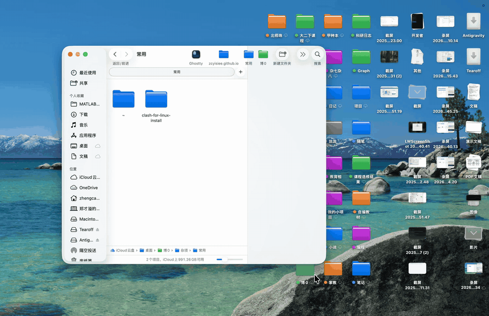

<b><font>Tearoff</font></b>

随手记录，顺手取用

<br clear="all" />

<p align="center">
  <b>简体中文</b> · <a href="README-en.md">English</a>
</p>

<p align="center">
  <a href="https://github.com/zcyisiee/Tearoff/releases"></a>
  <a href="https://github.com/zcyisiee/Tearoff/releases"></a>
  <br />
  
  
  <a href="LICENSE"></a>
</p>

**Tearoff** 的目标是找回在纸上随手记录的感觉。鼠标滑到屏幕边缘即可唤出Tearoff，划出界面后，Tearoff 自动收起。随拿随用，非常方便。当然，你也可以点击右上角的图钉来临时固定 Tearoff。

Tearoff 的核心对象是卡片。**文件卡片**对应一个 markdown 文件。**文件夹卡片**让你直接在面板里浏览和操作文件。另有一种特殊的文件卡片：**Daily 卡片**，每天一张，用来安排当天的待办。你可以把卡片当成日程表、备忘录、日记本或随笔用。我对日程表场景做了专门优化：在卡片上直接点击待办（`- [ ]`）即可打勾或取消，非常滴方便。



---


## 安装

**Homebrew**（推荐）：

```bash
brew tap zcyisiee/tap
brew install --cask tearoff
```

或从 [Releases](https://github.com/zcyisiee/Tearoff/releases) 下载最新的 `.dmg`，拖入「应用程序」即可。应用未经签名，手动安装首次启动前需要在终端执行：

```bash
xattr -cr /Applications/Tearoff.app
```

---


## 为什么做 Tearoff

在转行搞计算机前，我手边总是堆满了参考书和草稿纸。有想法时候随手撕一张纸就可以记录下来。这种做法不会干扰我正在做的事，让我觉得很自由。

到了电脑上，当我想临时记点东西时，得打开 APP、新建文件、起名字。Typora、Obsidian 这些编辑器都很优秀，但它们太「正式」了，每次打开都会抢占工作区，迫使我切换到另一个界面。对需要随手记录、随时查看的场景，这种侵入式的交互并不友好。更加糟糕的是，频繁的页面切换会让我分心，最后让我陷入决策瘫痪🥲

Tearoff 的目标就是把「撕张纸就能记」的感觉搬到屏幕上。鼠标滑到边缘就可以书写，点击别处就收起来，不会打断你手上正在做的任何事。

---


## 特点

- **非侵入式**：鼠标滑到屏幕边缘即出，点击别处即走。不打断你手上正在做的事，也不占用 Dock 与桌面空间。
- **顺手**：从「想记点东西」到「已经写下」，中间不需要新建文件、选择路径、命名这些步骤。
- **Daily 卡片**：每天自动生成一张以当天日期命名的卡片，专门用来列当日待办。做完一项点一下，当天的事一目了然。
- **文件夹卡片**：把常用文件夹放进卡片，浏览、打开、重命名、拖进拖出都可以在面板里完成，不用打开 Finder。
- **ADHD 友好**：不抢焦点，不弹窗，不要求你离开当前工作区。记完就走，随时回来看。
- **本地存储**：笔记就是磁盘上的 `.md` 文件，没有专有格式，也没有账号。你可以用任何编辑器打开它，用任何方式同步和备份。
- **UI 美观**：原生 SwiftUI 界面，配色、动画与手势都经过反复调整，尽量让它看起来像系统自带的一部分。

---


## 基本逻辑结构

Tearoff 只有两级界面：主界面和编辑器界面。

主界面的核心对象是卡片，目前分为文件卡片和文件夹卡片。文件卡片对应一个 markdown 文件，文件夹卡片对应磁盘上的一个文件夹。Daily 卡片是一种特殊的文件卡片，它对应以当天日期命名的 markdown 文件。

每张卡片有三种状态。默认是卡片状态，显示内容摘要；单击标题右侧的空白，进入临时编辑状态，可以原地写几句话；双击标题右侧的空白，进入编辑器界面，用于较长的写作。

主界面从上到下分三个区：最上面是置顶区，放你手动置顶的卡片；中间是 Daily 区，固定展示当天的 Daily 卡片；最底部是时间流，其余卡片按时间排列。

进入编辑器界面后，Tearoff 的行为等同于一个功能丰富的 Markdown 编辑器：所见即所得、代码高亮、LaTeX 公式渲染都已内置。

---


## 快速使用

鼠标滑到屏幕边缘唤出 Tearoff，移动到别处自动收起。

顶部一行是文件夹标签，右侧依次为搜索、新建文件夹、新建卡片和设置。最右边的图钉用来固定面板：默认逻辑是鼠标移开界面 Tearoff 就自动收起，点击图钉后面板会保持展开，方便你从别的窗口来回复制粘贴，再次点击即恢复自动收起。

在卡片上直接点击待办项即可勾选或取消勾选，不必进入编辑器。右键空白处（或右键「新建卡片」按钮）可以新建一张文件夹卡片，把常用目录拖到卡片顶栏即可收藏。


---


## 未来方向

接下来的重心是编辑器界面的用户体验和功能，争取在书写手感上赶上 Typora。计划中的工作包括表格的可视化编辑、图片拖入与预览、更完善的快捷键体系，以及多窗口、多显示器支持。

---


## 已知问题

文件夹卡片目前有一个未解决的 bug：拖动文件夹时如果速度过快，卡片可能会变成空白并卡死。遇到这种情况，把这张文件夹卡片拖到别的位置即可自动恢复。我正在努力修复这个问题。

---


## 技术栈

Swift 6.2 + SwiftUI，编辑器基于 TextKit 2，不依赖 WebKit 或 JavaScript。除功能实现之外，相当一部分精力花在了动画曲线、手势响应和过渡效果上——这些细节决定了它是否顺手。

架构概览、源码目录树、关键模式与开发环境配置，见 [CONTRIBUTING.md](CONTRIBUTING.md)。

---


## 致谢

感谢 [EdgeMark](https://github.com/dev-vasu/EdgeMark) 给我带来的灵感，本项目正是在 EdgeMark 的基础上改造而来。也要感谢 [SideNotes](https://www.apptorium.com/sidenotes)，它把边缘唤出的交互做到了极致，可惜是一个闭源且收费的项目。

Tearoff 同时构建于以下开源项目之上：


| 项目                                                                          | 许可证        | 说明                                        |
| --------------------------------------------------------------------------- | ---------- | ----------------------------------------- |
| [swift-markdown-engine](https://github.com/nodes-app/swift-markdown-engine) | Apache 2.0 | 基于 TextKit 2 的所见即所得 Markdown 编辑器，支撑整个编辑体验 |
| [HighlighterSwift](https://github.com/smittytone/HighlighterSwift)          | MIT        | 代码块语法高亮                                   |
| [SwiftMath](https://github.com/mgriebling/SwiftMath)                        | MIT        | LaTeX 公式渲染                                |
| [SwiftFormat](https://github.com/nicklockwood/SwiftFormat)                  | MIT        | 构建流水线中的代码格式化                              |


---


## 许可证

本项目基于 [GNU General Public License v3.0](LICENSE) 授权。
