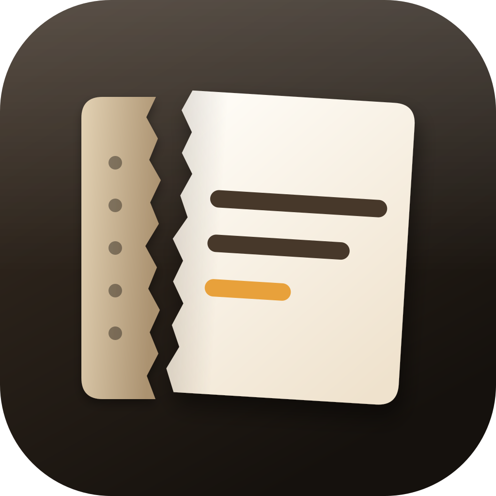
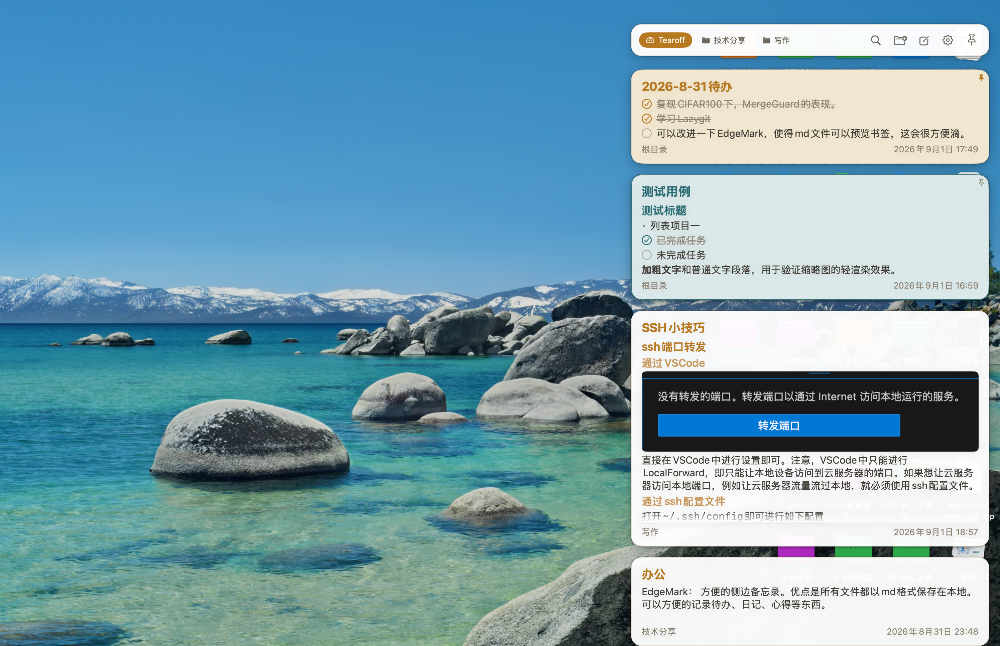

**Tearoff**

 一款随手记录的便签。

**简体中文** · [English](README-en.md)

  


**Tearoff 的目标**：找回传统纸媒‘随手记录’的感觉。Tearoff 最大的优势是便利性，只需将鼠标滑到屏幕边缘即可唤出 Tearoff。每一张卡片都对应一个 markdown 文件，单击即可就地编辑，双击则进入编辑器进行深入编辑。

你可以将卡片作为日程表、备忘录、日记本或随笔使用。我对日程表场景进行了优化，在卡片内点击待办(`- [ ]`)即可打勾或取消勾选。



---


## 安装

在 [Releases](https://github.com/zcyisiee/Tearoff/releases) 下载最新的 `.dmg`，拖入「应用程序」即可。应用未经签名，首次启动前需要在终端执行：

```bash
xattr -cr /Applications/Tearoff.app
```

---


## 为什么做 Tearoff

在转行搞计算机前，我手边总是堆满了书和纸。有想法了，随手撕一张纸下来就可以写。这种做法不会干扰我正在做的事，让我觉得很自由。

到了电脑上，想临时记点东西，我就得打开 APP、新建文件、选路径、起名字。Typora、Obsidian 这些编辑器确实很成熟，但它们太‘正式’了，每次打开都会抢占工作区，迫使我切换到另一个界面。对于需要随手记录、随时查看的场景，这种侵入式的交互并不友好。

Tearoff 想把「撕张纸就能记」的感觉搬到屏幕上。鼠标滑到边缘就能写，点击别处就收起，不打断我手上正在做的任何事。

---


## 特点

- **非侵入式**：鼠标滑到屏幕边缘即出，点击别处即走。不打断你手上正在做的事，也不占用 Dock 与桌面空间。
- **顺手**：从「想记点东西」到「已经写下」，中间不需要新建文件、选择路径、命名这些步骤。
- **ADHD 友好**：不抢焦点，不弹窗，不要求你离开当前工作区。记完就走，随时回来看。
- **本地存储**：笔记就是磁盘上的 `.md` 文件，没有专有格式，也没有账号。你可以用任何编辑器打开它，用任何方式同步和备份。
- **UI 美观**：原生 SwiftUI 界面，配色、动画与手势都经过反复调整，尽量让它看起来像系统自带的一部分。

---


## 快速使用

Tearoff 只有两级界面。

**主界面**是卡片列表，每张卡片对应一个 markdown 文件，直接显示内容摘要。

- 单击卡片**标题右侧**的空白区域，进入**临时编辑**——原地展开输入，适合记一句话。
- 双击*标题右侧**，进入**编辑器**，用于较长的写作。
- 在卡片区域直接点击待办项即可勾选或取消勾选，不必进入编辑器。这是我对日程表场景的优化。
- 在卡片左端拖拽可以调整Tearoff的宽度
- 点击顶部的图钉可以固定面板。

顶部一行是文件夹标签，右侧依次为搜索、新建文件夹、新建卡片和设置。最右边的**图钉**用来固定面板：默认逻辑是鼠标移开界面 Tearoff 就自动收起，点击图钉后面板会保持展开，方便你从别的窗口来回复制粘贴，再次点击即恢复自动收起。


除此之外，Tearoff也提供了丰富的快捷键，涵盖应用快捷键与markdown快捷键。例如`command + N`是新建笔记，`command + B`是加粗文字等。具体的快捷键说明在设置中。
---


## TODO

未来的重心是编辑器体验，争取在书写手感上赶上 Typora。具体方向：

- 表格的可视化编辑
- 图片拖入与预览
- 更完善的快捷键体系
- 多窗口 / 多显示器支持

---


## 技术栈

Swift 6.2 + SwiftUI，编辑器基于 TextKit 2，不依赖 WebKit 或 JavaScript。除功能实现之外，相当一部分精力花在了动画曲线、手势响应和过渡效果上——这些细节决定了它是否「顺手」。

架构概览、源码目录树、关键模式与开发环境配置，见 [CONTRIBUTING.md](CONTRIBUTING.md)。

---


## 致谢

感谢 [EdgeMark](https://github.com/dev-vasu/EdgeMark) 给我带来的灵感，本项目正是在 EdgeMark 的基础上改造而来。也要感谢 [SideNotes](https://www.apptorium.com/sidenotes)，它把边缘唤出的交互做到了极致，可惜是一个闭源且收费的项目。

Tearoff 同时构建于以下开源项目之上：


| 项目                                                                          | 许可证        | 说明                                        |
| --------------------------------------------------------------------------- | ---------- | ----------------------------------------- |
| [swift-markdown-engine](https://github.com/nodes-app/swift-markdown-engine) | Apache 2.0 | 基于 TextKit 2 的所见即所得 Markdown 编辑器，支撑整个编辑体验 |
| [HighlighterSwift](https://github.com/smittytone/HighlighterSwift)          | MIT        | 代码块语法高亮                                   |
| [SwiftMath](https://github.com/mgriebling/SwiftMath)                        | MIT        | LaTeX 公式渲染                                |
| [SwiftFormat](https://github.com/nicklockwood/SwiftFormat)                  | MIT        | 构建流水线中的代码格式化                              |


---


## 许可证

本项目基于 [GNU General Public License v3.0](LICENSE) 授权。